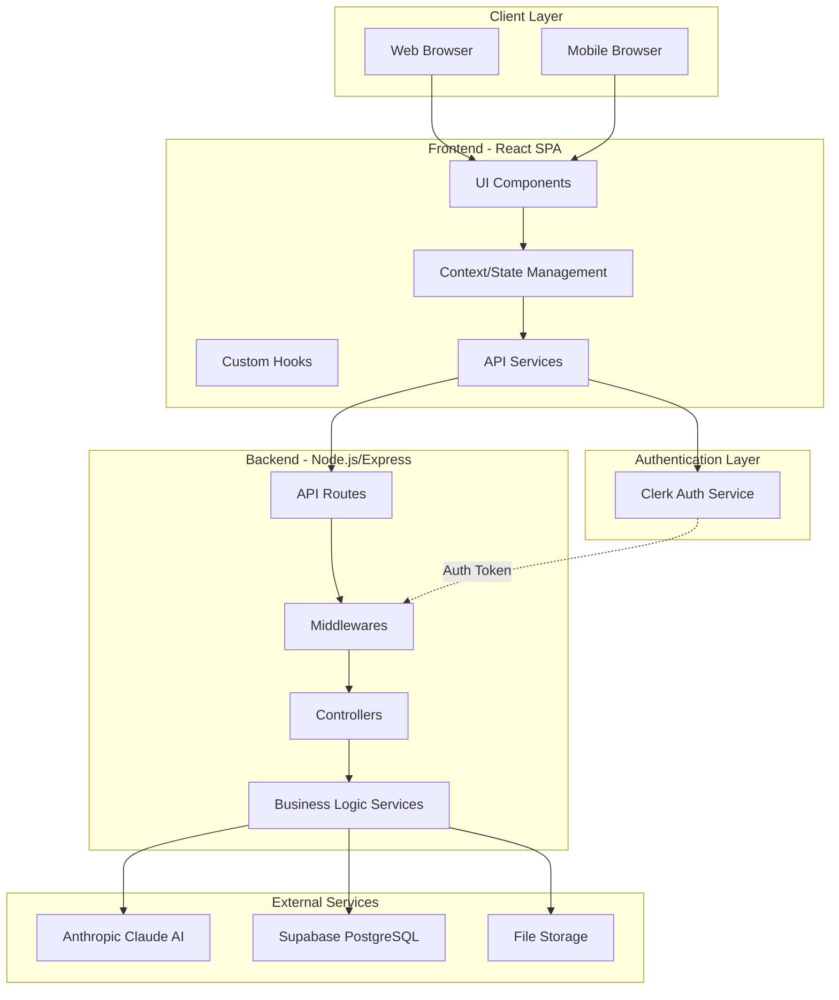
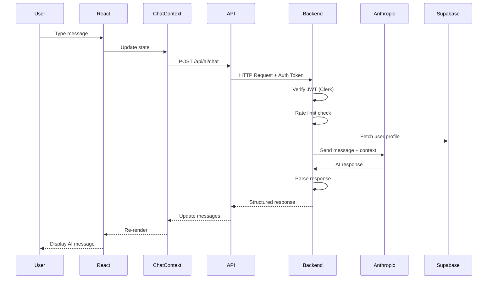
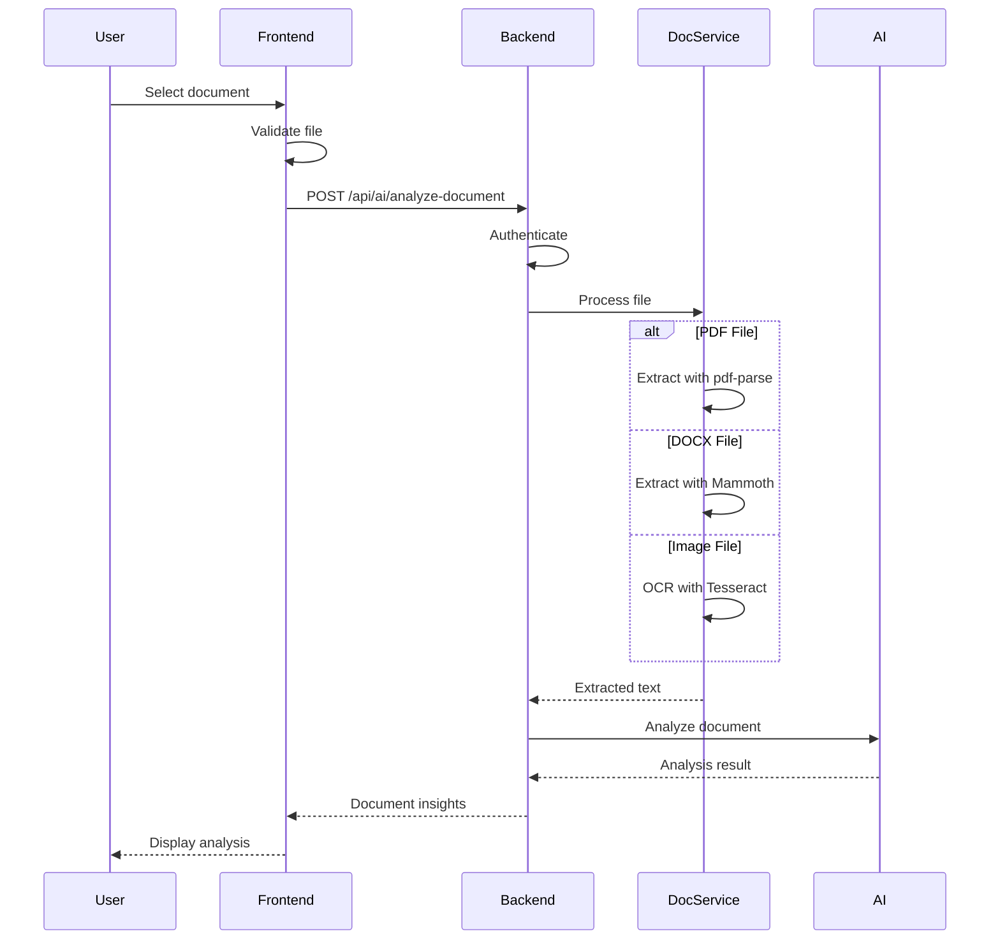
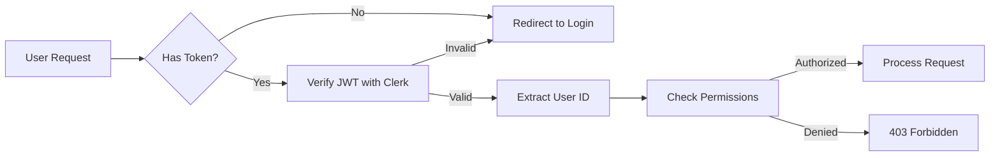
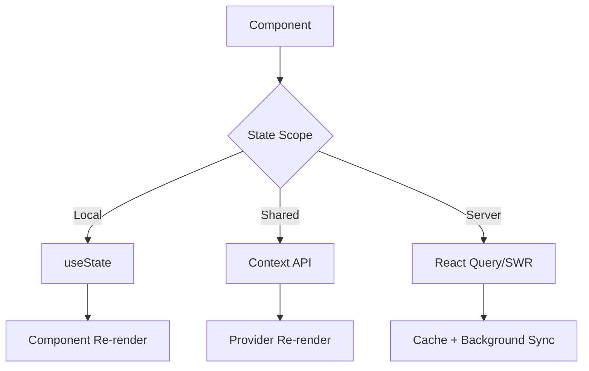
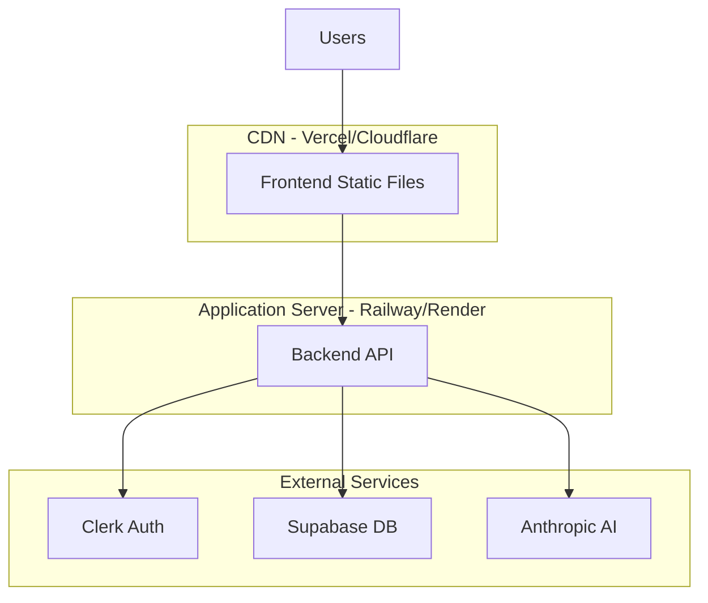
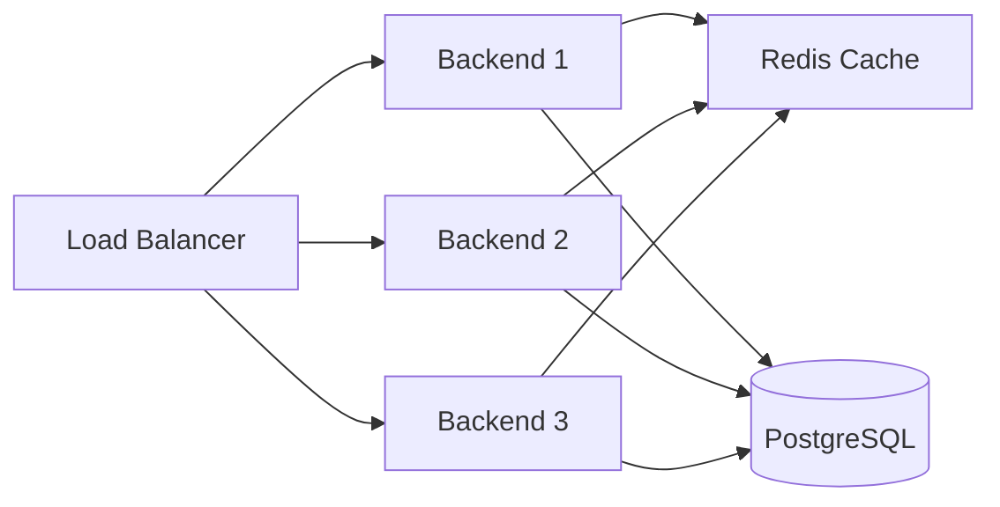

# System Architecture

This document provides a comprehensive overview of the Legal AI Assistant's system architecture, design decisions, and technical implementation details.

## Table of Contents

- [System Overview](#system-overview)
- [High-Level Architecture](#high-level-architecture)
- [Component Architecture](#component-architecture)
- [Data Flow](#data-flow)
- [Technology Stack Rationale](#technology-stack-rationale)
- [Design Patterns](#design-patterns)
- [Security Architecture](#security-architecture)
- [Database Schema](#database-schema)
- [API Architecture](#api-architecture)
- [Frontend Architecture](#frontend-architecture)
- [Deployment Architecture](#deployment-architecture)
- [Scalability Considerations](#scalability-considerations)

---

## System Overview

The Legal AI Assistant is a full-stack web application designed to provide intelligent legal guidance through AI-powered conversations and document analysis. The system follows a modern three-tier architecture with clear separation of concerns.

### Core Principles

1. **Separation of Concerns** - Clear boundaries between presentation, business logic, and data layers
2. **Scalability** - Designed to handle increased load through horizontal scaling
3. **Security First** - Authentication, authorization, and data protection at every layer
4. **User Experience** - Fast, responsive, and accessible interface
5. **Maintainability** - Clean code, TypeScript for type safety, modular design

---

## High-Level Architecture



---

## Component Architecture

### Frontend Components

```
frontend/src/
├── components/          # Reusable UI components
│   ├── ui/             # Base UI components (shadcn/ui)
│   ├── ChatContainer   # Main chat interface
│   ├── ChatMessage     # Individual message display
│   ├── ChatInput       # Message input with voice
│   ├── DocumentUploader # File upload interface
│   ├── FlowchartRenderer # Mermaid diagram rendering
│   ├── AudioPlayer     # TTS playback
│   └── ...
├── pages/              # Route-level pages
│   ├── LandingPage     # Marketing/home page
│   ├── AIZonePage      # Main chat application
│   ├── Templates       # Document templates
│   ├── FAQ             # Help/FAQ
│   └── Contact         # Contact form
├── context/            # Global state management
│   └── ChatContext     # Chat history & state
├── hooks/              # Custom React hooks
│   ├── useSpeechToText # Voice input
│   └── useTextToSpeech # Audio output
├── services/           # API communication
│   └── api.ts          # Axios client & methods
└── utils/              # Helper functions
    ├── chatStorage     # LocalStorage management
    ├── responseParser  # AI response parsing
    └── flowchartThemes # Mermaid themes
```

### Backend Components

```
backend/src/
├── routes/             # Express route definitions
│   ├── ai.routes       # AI chat endpoints
│   ├── auth.routes     # Authentication endpoints
│   └── document.routes # Document upload/analysis
├── controllers/        # Request handlers
│   ├── ai.controller   # AI interaction logic
│   └── auth.controller # Auth operations
├── middlewares/        # Express middlewares
│   ├── auth.middleware # JWT verification
│   └── rateLimit       # Rate limiting
├── services/           # Business logic layer
│   ├── anthropic.service # Claude AI integration
│   ├── document.service  # File processing
│   └── profile.service   # User profile management
├── types/              # TypeScript definitions
└── utils/              # Utility functions
    └── validation      # Zod schemas
```

---

## Data Flow

### Chat Message Flow



### Document Upload Flow



---

## Technology Stack Rationale

### Frontend Technologies

| Technology | Purpose | Rationale |
|------------|---------|-----------|
| **React 18** | UI Framework | Virtual DOM, component reusability, large ecosystem |
| **TypeScript** | Type Safety | Catch errors at compile-time, better IDE support |
| **Vite** | Build Tool | Fast HMR, optimized builds, modern ES modules |
| **Tailwind CSS** | Styling | Utility-first, rapid development, small bundle size |
| **shadcn/ui** | UI Components | Accessible, customizable, copy-paste approach |
| **React Router** | Routing | Standard for React SPAs, declarative routing |
| **Clerk** | Authentication | Pre-built UI, security best practices, easy integration |
| **Axios** | HTTP Client | Interceptors, request cancellation, better error handling |
| **Mermaid** | Diagrams | Declarative syntax, flowchart generation from text |

### Backend Technologies

| Technology | Purpose | Rationale |
|------------|---------|-----------|
| **Node.js** | Runtime | JavaScript everywhere, non-blocking I/O, npm ecosystem |
| **Express** | Web Framework | Minimal, flexible, middleware architecture |
| **TypeScript** | Type Safety | Same language as frontend, improved reliability |
| **Anthropic SDK** | AI Provider | State-of-art LLM, context understanding, safety features |
| **Supabase** | Database | PostgreSQL-based, real-time, built-in auth |
| **Multer** | File Upload | Standard for multipart/form-data, streaming support |
| **Zod** | Validation | Type-safe schemas, runtime validation |
| **Tesseract.js** | OCR | Client-side capable, no external API needed |

---

## Design Patterns

### Frontend Patterns

#### 1. **Context + Hooks Pattern**
```typescript
// Centralized state management without Redux
export const ChatContext = createContext<ChatContextType>()

export const useChatContext = () => {
  const context = useContext(ChatContext)
  if (!context) throw new Error('useChatContext must be within provider')
  return context
}
```

#### 2. **Custom Hooks for Reusability**
```typescript
// Encapsulate complex logic
export const useSpeechToText = () => {
  const [isListening, setIsListening] = useState(false)
  const [transcript, setTranscript] = useState('')
  // ... recognition logic
  return { isListening, transcript, startListening, stopListening }
}
```

#### 3. **Component Composition**
```typescript
// Small, focused components
<ChatContainer>
  <ChatMessage />
  <ChatMessage />
  <ChatInput />
</ChatContainer>
```

#### 4. **Protected Routes Pattern**
```typescript
// Authentication boundary
<Route element={<ProtectedRoute />}>
  <Route path="/ai-zone" element={<AIZonePage />} />
</Route>
```

### Backend Patterns

#### 1. **Layered Architecture**
```
Routes → Controllers → Services → Database
```

#### 2. **Middleware Chain**
```typescript
app.use(cors())
app.use(express.json())
app.use(rateLimit)
router.use(authMiddleware)
```

#### 3. **Service Layer Pattern**
```typescript
// Separate business logic from HTTP concerns
class AnthropicService {
  async generateResponse(message: string, context: Context) {
    // Complex AI logic isolated here
  }
}
```

#### 4. **Dependency Injection**
```typescript
// Services receive dependencies
constructor(
  private anthropicClient: Anthropic,
  private supabaseClient: SupabaseClient
) {}
```

---

## Security Architecture

### Authentication & Authorization



### Security Layers

1. **Transport Security**
   - HTTPS in production
   - Secure cookie flags
   - HSTS headers

2. **Authentication**
   - Clerk JWT tokens
   - Token expiration
   - Refresh token rotation

3. **Authorization**
   - User-based access control
   - Supabase Row Level Security (RLS)
   - API rate limiting

4. **Input Validation**
   - Zod schema validation
   - File type checking
   - Size limits on uploads

5. **Data Protection**
   - Environment variables for secrets
   - No sensitive data in client code
   - PostgreSQL encryption at rest

6. **API Security**
   - CORS configuration
   - Rate limiting per user
   - Request size limits

---

## Database Schema

### Supabase Tables

#### Profiles Table
```sql
CREATE TABLE profiles (
  id UUID PRIMARY KEY REFERENCES auth.users(id) ON DELETE CASCADE,
  name VARCHAR(255) NOT NULL,
  age INTEGER NOT NULL CHECK (age >= 13),
  gender VARCHAR(50) NOT NULL CHECK (gender IN ('male', 'female', 'other')),
  created_at TIMESTAMP DEFAULT CURRENT_TIMESTAMP,
  updated_at TIMESTAMP DEFAULT CURRENT_TIMESTAMP
);

-- Indexes
CREATE INDEX idx_profiles_id ON profiles(id);

-- RLS Policies
ALTER TABLE profiles ENABLE ROW LEVEL SECURITY;

CREATE POLICY "Users can read own profile"
  ON profiles FOR SELECT
  USING (auth.uid() = id);

CREATE POLICY "Users can update own profile"
  ON profiles FOR UPDATE
  USING (auth.uid() = id);
```

#### Future Tables (Planned)

```sql
-- Conversation history
CREATE TABLE conversations (
  id UUID PRIMARY KEY DEFAULT uuid_generate_v4(),
  user_id UUID REFERENCES profiles(id) ON DELETE CASCADE,
  title VARCHAR(255),
  created_at TIMESTAMP DEFAULT CURRENT_TIMESTAMP,
  updated_at TIMESTAMP DEFAULT CURRENT_TIMESTAMP
);

-- Messages within conversations
CREATE TABLE messages (
  id UUID PRIMARY KEY DEFAULT uuid_generate_v4(),
  conversation_id UUID REFERENCES conversations(id) ON DELETE CASCADE,
  role VARCHAR(20) NOT NULL CHECK (role IN ('user', 'assistant')),
  content TEXT NOT NULL,
  metadata JSONB,
  created_at TIMESTAMP DEFAULT CURRENT_TIMESTAMP
);

-- Document uploads
CREATE TABLE documents (
  id UUID PRIMARY KEY DEFAULT uuid_generate_v4(),
  user_id UUID REFERENCES profiles(id) ON DELETE CASCADE,
  filename VARCHAR(255) NOT NULL,
  file_type VARCHAR(50) NOT NULL,
  file_size INTEGER NOT NULL,
  storage_path TEXT NOT NULL,
  extracted_text TEXT,
  created_at TIMESTAMP DEFAULT CURRENT_TIMESTAMP
);
```

---

## API Architecture

### RESTful Design

```
BASE_URL: http://localhost:3001

Authentication:
POST   /api/auth/signup          # Create account + profile
POST   /api/auth/login           # Authenticate user
POST   /api/auth/logout          # End session
GET    /api/auth/profile         # Get user profile
PUT    /api/auth/profile         # Update profile

AI Assistant:
POST   /api/ai/chat              # Send message
POST   /api/ai/analyze-document  # Upload & analyze
GET    /api/ai/history           # Get chat history
DELETE /api/ai/history/:id       # Delete conversation
```

### Request/Response Format

#### Chat Request
```typescript
POST /api/ai/chat
Headers: {
  Authorization: Bearer <token>
  Content-Type: application/json
}
Body: {
  message: string
  conversationId?: string
  language?: string
}
```

#### Chat Response
```typescript
{
  success: boolean
  data: {
    matterSummary: string
    incidentType: string
    clarifyingQuestions: string[]
    conditionalGuidance: string
    legalPathways: string[]
    flowchart: string
    disclaimer: string
  }
}
```

### Error Handling

```typescript
{
  success: false
  error: {
    code: string        // e.g., "AUTH_FAILED", "VALIDATION_ERROR"
    message: string     // Human-readable message
    details?: any       // Additional context
  }
}
```

---

## Frontend Architecture

### State Management Strategy



### Routing Structure

```typescript
<BrowserRouter>
  <Routes>
    {/* Public Routes */}
    <Route path="/" element={<LandingPage />} />
    <Route path="/faq" element={<FAQ />} />
    <Route path="/contact" element={<Contact />} />
    
    {/* Protected Routes */}
    <Route element={<ProtectedRoute />}>
      <Route path="/ai-zone" element={<AIZonePage />} />
      <Route path="/templates" element={<Templates />} />
      <Route path="/profile" element={<ProfilePage />} />
    </Route>
  </Routes>
</BrowserRouter>
```

### Component Hierarchy

```
App
├── Navbar (always visible)
├── Routes
│   ├── LandingPage
│   │   ├── HeroSection
│   │   ├── FeaturesSection
│   │   ├── MetricsSection
│   │   └── TrustSection
│   ├── AIZonePage (Protected)
│   │   ├── Sidebar
│   │   └── ChatContainer
│   │       ├── ChatMessage[]
│   │       │   ├── FlowchartRenderer
│   │       │   └── AudioPlayer
│   │       └── ChatInput
│   │           ├── DocumentUploader
│   │           └── SpeechToText
│   └── Templates (Protected)
└── Footer
```

---

## Deployment Architecture

### Production Environment



### Environment Configuration

#### Frontend (Vercel)
```json
{
  "buildCommand": "npm run build",
  "outputDirectory": "dist",
  "framework": "vite",
  "environmentVariables": {
    "VITE_API_BASE_URL": "https://api.example.com",
    "VITE_CLERK_PUBLISHABLE_KEY": "pk_live_..."
  }
}
```

#### Backend (Railway)
```yaml
services:
  backend:
    build:
      command: npm run build
    start:
      command: npm start
    env:
      PORT: ${{ PORT }}
      NODE_ENV: production
      ANTHROPIC_API_KEY: ${{ ANTHROPIC_API_KEY }}
      CLERK_SECRET_KEY: ${{ CLERK_SECRET_KEY }}
      SUPABASE_URL: ${{ SUPABASE_URL }}
```

---

## Scalability Considerations

### Current Limitations

1. **Single Server Instance** - Backend runs on one process
2. **In-Memory Session** - No distributed session management
3. **File Storage** - Local file system (not cloud storage)
4. **Database Connection** - Limited connection pool

### Scaling Strategy

#### Horizontal Scaling (Future)



#### Optimization Opportunities

1. **Caching Layer**
   - Redis for session storage
   - Cache frequent AI responses
   - CDN for static assets

2. **Database Optimization**
   - Connection pooling
   - Read replicas for queries
   - Indexing strategies

3. **File Storage**
   - AWS S3 / Cloudflare R2
   - CDN for document delivery
   - Async processing queues

4. **API Gateway**
   - Request throttling
   - Response caching
   - API versioning

5. **Microservices (Long-term)**
   - Separate document processing service
   - Dedicated AI service
   - User management service

---

## Monitoring & Observability

### Metrics to Track

1. **Application Metrics**
   - Request rate (RPM)
   - Error rate
   - Response time (P50, P95, P99)
   - Active users

2. **Infrastructure Metrics**
   - CPU usage
   - Memory usage
   - Network I/O
   - Disk usage

3. **Business Metrics**
   - Chat sessions per user
   - Document uploads
   - AI response quality
   - User retention

### Recommended Tools

- **Error Tracking**: Sentry
- **Logging**: Pino / Winston → CloudWatch
- **Analytics**: PostHog / Mixpanel
- **Uptime**: Uptime Robot / Pingdom
- **APM**: New Relic / Datadog

---

## Future Architecture Enhancements

### Short-term (3-6 months)

- [ ] Implement conversation persistence in Supabase
- [ ] Add Redis caching layer
- [ ] Migrate to cloud file storage (S3)
- [ ] Implement comprehensive logging
- [ ] Add real-time features with WebSockets

### Medium-term (6-12 months)

- [ ] Microservices architecture
- [ ] Message queue for async processing (Bull/BullMQ)
- [ ] GraphQL API layer
- [ ] Advanced analytics dashboard
- [ ] Multi-tenant support

### Long-term (12+ months)

- [ ] Kubernetes deployment
- [ ] Multi-region deployment
- [ ] AI model fine-tuning pipeline
- [ ] Real-time collaboration features
- [ ] Mobile native applications

---

## Conclusion

The Legal AI Assistant architecture is designed with modularity, security, and scalability in mind. The current implementation provides a solid foundation for growth while maintaining code quality and user experience. As the application evolves, the architecture can adapt to accommodate new features and increased scale without requiring major refactoring.

### Key Strengths

✅ Clear separation of concerns  
✅ Type-safe development with TypeScript  
✅ Modern, performant tech stack  
✅ Security-first approach  
✅ Scalable design patterns  

### Areas for Improvement

🔄 Add comprehensive testing suite  
🔄 Implement CI/CD pipelines  
🔄 Enhanced monitoring and alerting  
🔄 Performance optimization  
🔄 Documentation automation  

---

**Last Updated**: January 27, 2026  
**Version**: 1.0  
**Maintained by**: Development Team
